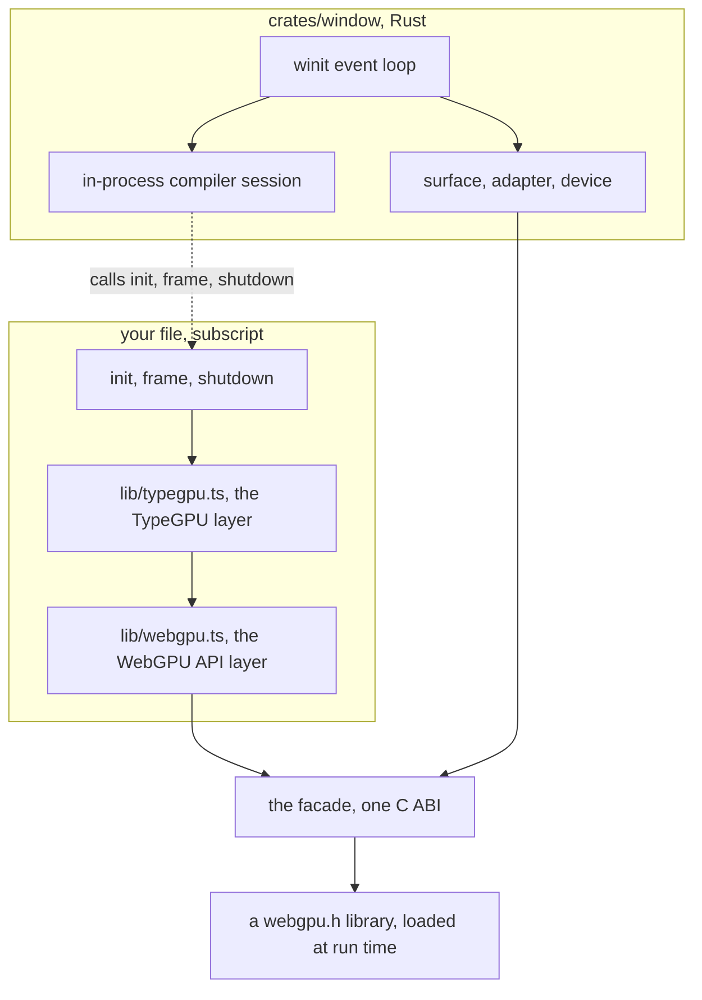
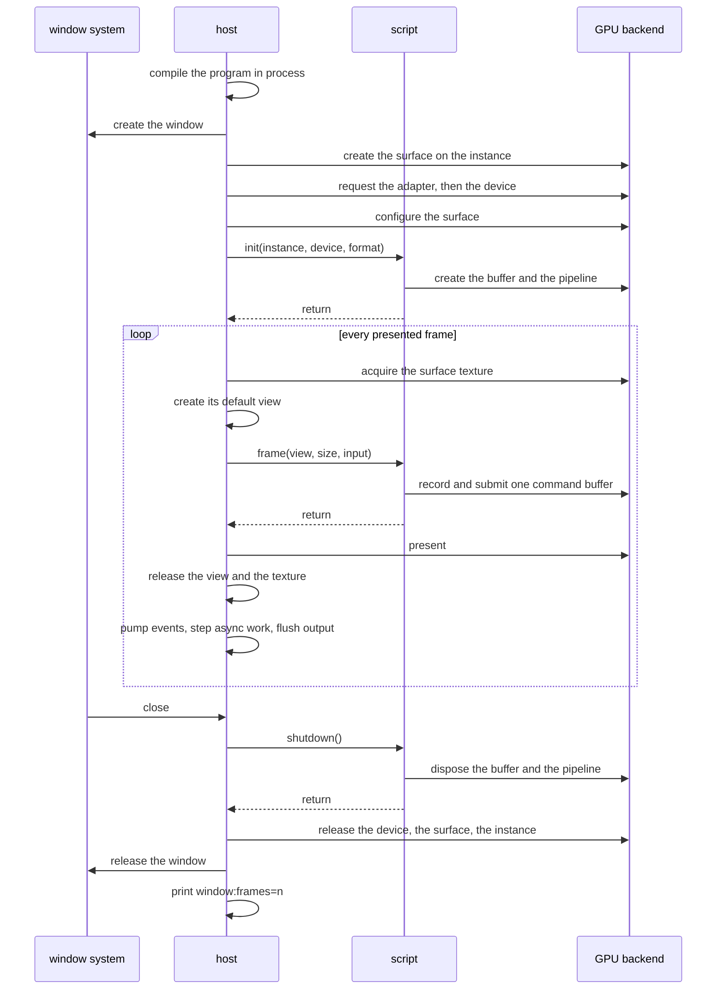
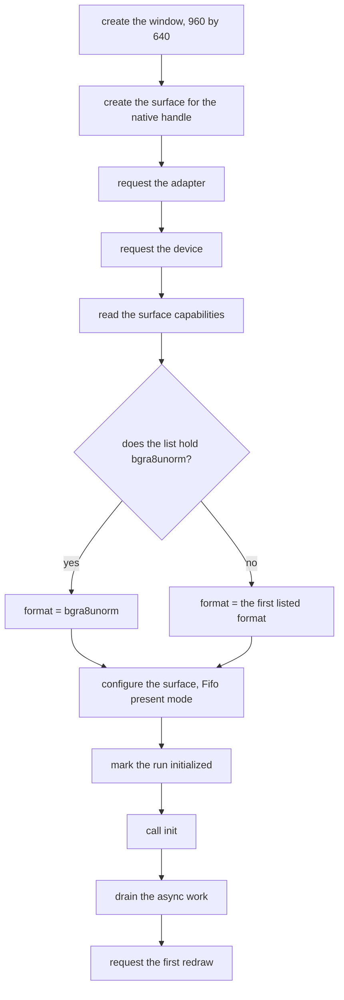
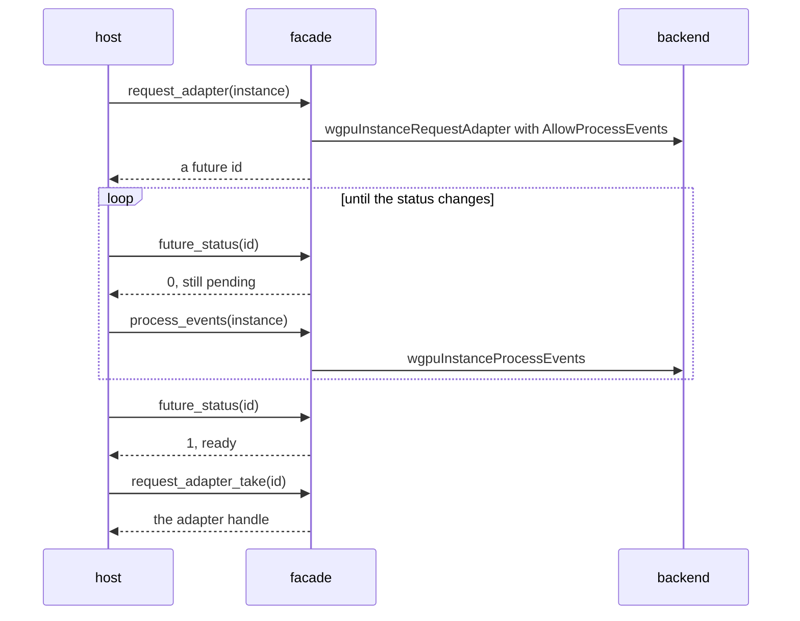
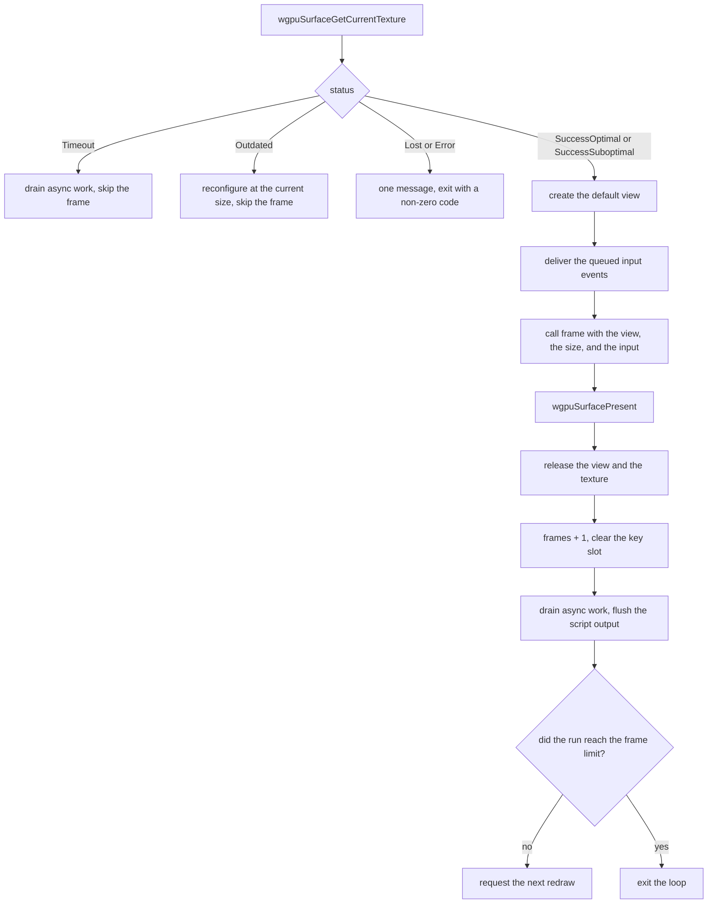

# A windowed program, from the first frame to the last handle

This document walks `examples/window-triangle/main.ts` from top to bottom. The
example draws one triangle in a native window, and the space key changes the
clear color. The file holds 218 lines of subscript, and 47 of them are
comments. It imports no framework and no engine.

The triangle is not the interesting part. Two other things are. The first is the
split between a Rust host and a script. The host owns the window and the loop,
and the script owns the frame. The second is how much work happens before the
program starts. The WGSL, the vertex layout, and every byte offset exist as
constants by the time the first line runs.

One point comes before both, because it changes how you read everything else.
The host in this repository is an example. Your application brings its own
window, its own input, and its own loop, so you write your own host and call the
script from it. The chapter after the split below states what such a host must
keep and what it chooses.

If you know WebGPU in a browser, most of this looks familiar. Where it differs,
the reason is one of three. subscript has no exceptions. It has no garbage
collector. This library moves to compile time what a browser library does at run
time.

## Run it first

Two environment variables select the GPU backend. The first names the adapter
backend, and the second names the webgpu.h shared library that the facade loads.

```sh
SUBSCRIPT_TYPEGPU_BACKEND=metal \
SUBSCRIPT_TYPEGPU_BACKEND_LIB=/path/to/libyawgpu.dylib \
tools/window.sh examples/window-triangle/main.ts
```

A window opens with an orange triangle on a dark blue field. Press space and the
field turns dark red, then dark green, then dark blue again. Resize the window
and the triangle keeps its shape. Close the window and the host prints one line:

```text
window:frames=963
```

Add `--frames 30` to close the window after 30 presented frames. That form runs
without a person at the keyboard, so it fits a smoke check.

## Who owns what

A windowed program has two halves. The host is a Rust binary,
`crates/window`. The script is your file. The split is not a suggestion. It is
the reason the script never sees a window object.

| The host owns | The script owns |
|---|---|
| the window and its events | the render pipeline |
| the surface and its configuration | the vertex buffer |
| the instance, the adapter, the device | the bind groups and the textures it creates |
| the event loop and the frame cadence | one frame's command encoder and render pass |
| the surface texture and its view | the module state between frames |

The script receives the device and the frame's texture view as borrowed
handles. It wraps both, and it disposes neither. Everything the script itself
creates, it releases by name in `shutdown`.

The stack under one frame has four layers. The host and the script sit side by
side at the top, and they meet at the facade.



The host links no backend. The facade loads the shared library that
`SUBSCRIPT_TYPEGPU_BACKEND_LIB` names and resolves the `wgpu*` symbols it
needs. One binary therefore runs against any webgpu.h implementation.

## Write your own host

`crates/window` is one host. It runs the examples of this repository and its
smoke checks, and it shows the integration end to end. It is a convenience and a
worked example. It is not a framework, and your application does not have to use
it.

Your engine owns a window, an input model, and a frame cadence already. The
contract under this host is small. Most of what the rest of this document shows
is this host's choice, and the three lists below separate the two.

### subscript fixes these

- A host-callable export is synchronous, returns `void`, and takes boundary
  scalars and opaque handles.
- A development session calls an export by name with a list of arguments. The
  ship tier emits `void subscript_export_<name>(subscript_rt_context* ctx, ...)`
  for the same export, so a C host calls it directly.
- `print` writes into a sink that the runtime owns. The host drains it.
- Async work steps through the session, one step per call.

### This library fixes these

- Every callback the facade registers terminates inside the facade and uses the
  process-events mode. A host polls a future instead of receiving a callback.
- A handle belongs to its creator and goes back by name.
- One instance serves one run, and the backend library comes from an environment
  variable.

### This host chose these

- The three entry names and their parameter lists. `init`, `frame`, and
  `shutdown` are this host's vocabulary, not the language's. Yours can be
  `onStart` and `onTick`.
- `winit`, a 960 by 640 window, and the Fifo present mode.
- The format preference, `bgra8unorm` before the first listed format.
- One key scalar per frame, three button bits, and 30 pixels per wheel line.
- The four optional input entries, the `--frames` limit, and the
  `window:frames=<n>` line.

### Six steps for a host of your own

1. Create the facade instance.
2. Create your window, and create the surface for its native handle.
3. Request the adapter and the device. Poll each future and pump the instance
   until it resolves.
4. Load the script. During development, compile it in process and keep the
   session. To ship, build the emitted C and call the exported symbols.
5. Call your entries with handles and scalars. After each call, pump the
   instance, step the session until no async work remains, and drain the print
   sink.
6. Release in dependency order: the script's handles, the device, the surface,
   the instance, and the window.

### What you gain by writing your own

You choose the vocabulary. A renderer needs `frame`, and a simulation needs
`step`, and an editor needs both plus a `reloadScene`. The language admits any
name, and the entry list is yours.

You choose the cadence. This host presents one frame per redraw request. Yours
can run a fixed simulation step and a variable render step, or drive several
scripts in one loop.

You gain hot reload. The development session reloads a changed file at a frame
boundary. The swap is accepted when the module's declaration hash is unchanged,
so a body edit reloads and a signature change needs a restart. This host does
not use that feature. A host of your own watches the file and reloads between
frames.

The one thing you do not change is the boundary. Handles and scalars cross it,
callbacks do not, and every handle goes back to the side that made it.

The rest of this document walks one host and one script in full. Read the script
chapters for the shape of your own script, and the host chapter for the steps
your own host repeats.

## The three entries

This host calls three exported functions. The names are its vocabulary, and a
harness test holds every example to them. The signatures below are therefore
fixed for this host, and a host of your own picks its own.

```ts program=examples/window-triangle/main.ts
export function init(
  instance: SubscriptTypegpuInstance,
  device: SubscriptTypegpuDevice,
  format: GPUTextureFormat,
): void {
```

```ts program=examples/window-triangle/main.ts
export function frame(
  view: SubscriptTypegpuTextureView,
  width: u32,
  height: u32,
  key: u32,
  pointerX: f32,
  pointerY: f32,
  buttons: u32,
): void {
```

```ts program=examples/window-triangle/main.ts
export function shutdown(): void {
```

The order over one run reads like this.



Three entries instead of one `main` is a consequence of the split. The host owns
the loop, so the script cannot hold a `while` loop of its own. Each entry runs
to completion and returns.

## Before the first line runs

Look at the declaration that ties the two kernels together.

```ts program=examples/window-triangle/main.ts
export const tri: RenderPipelineSpec = renderPipeline<Vertex, Varyings>(vert, frag, {
  format: "bgra8unorm",
});
```

In a browser library this line builds an object at run time. Here it is a
declaration that a generator reads before the program runs. The generator walks
the typed representation of the file, finds this call, follows the call graph of
`vert` and `frag`, and emits a support module. The example imports it as
`./main.typegpu`, and the runner produces it in memory.

The schema and the two kernels are ordinary subscript.

```ts program=examples/window-triangle/main.ts
@CStruct
class Vertex {
  position: Vec2f;

  constructor(position: Vec2f) {
    this.position = position;
  }
}
```

```ts program=examples/window-triangle/main.ts
function vert(value: Vertex, ctx: VertexInvocation): Varyings {
  return new Varyings(new Vec4f(value.position.x, value.position.y, 0.0, 1.0));
}
```

```ts program=examples/window-triangle/main.ts
function frag(input: Varyings, ctx: FragmentInvocation): Vec4f {
  return new Vec4f(0.95, 0.45, 0.15, 1.0);
}
```

The generator turns those three declarations into this WGSL, and the emitted
text is the whole shader module.

```wgsl
struct Vertex {
  @location(0u) position: vec2<f32>,
}

struct Varyings {
  @builtin(position) position: vec4<f32>,
}

@vertex
fn vert(value: Vertex) -> Varyings {
  return Varyings(vec4<f32>(value.position.x, value.position.y, 0.0f, 1.0f));
}

@fragment
fn frag(input: Varyings) -> @location(0u) vec4<f32> {
  return vec4<f32>(0.95f, 0.45f, 0.15f, 1.0f);
}
```

Read the two structs against the two classes. The `@location(0u)` attribute on
`Vertex.position` comes from the field order of the schema class. The
`@builtin(position)` attribute on `Varyings.position` comes from the field name
and the type. Nothing in the subscript source spells either attribute.

The same pass emits these constants. This example imports six of them.

| Constant | Value | What it carries |
|---|---|---|
| `Vertex_SIZE` | 8 | the schema's size in bytes |
| `Vertex_STRIDE` | 8 | the byte distance between two vertices |
| `Vertex_OFFSET_position` | 0 | the field's byte offset |
| `tri_WGSL` | the module above | the shader source as one string |
| `tri_VERTEX_ENTRY` | `"vert"` | the vertex entry point name |
| `tri_FRAGMENT_ENTRY` | `"frag"` | the fragment entry point name |
| `tri_TARGET_FORMAT` | `"bgra8unorm"` | the format the declaration fixed |
| `tri_VERTEX_LAYOUT0` | a layout value | stride 8, one `float32x2` attribute at offset 0 |

The vertex buffer layout is worth one more look. The generator derived it from
the schema class alone.

```ts
export const tri_VERTEX_LAYOUT0: VertexBufferLayoutSpec = {
  arrayStride: 8,
  stepMode: "vertex",
  attributes: [
    { format: "float32x2", offset: 0, shaderLocation: 0 },
  ],
};
```

Two consequences follow. A layout error is a build error, not a black screen at
run time. And the WGSL is a readable artifact, not a string a library assembles
while your program runs. The runner emits it in memory. This command writes it
to a directory of your choice:

```sh
cargo run -p subscript-typegpu-gen -- gen examples/window-triangle/main.ts \
  --lib lib -o /tmp/out
```

## init: build once

The host calls `init` after it configures the surface. Everything the script
builds for the whole run belongs here.

### The format check comes first

```ts program=examples/window-triangle/main.ts
  if (format !== tri_TARGET_FORMAT) {
    print(`FAIL format expected=${tri_TARGET_FORMAT} actual=${format}`);
    return;
  }
```

The host picks `bgra8unorm` when the surface reports it, and the first listed
format otherwise. The declaration fixed the target format as a literal, so the
two must agree. This check turns a mismatch into one printed line and an early
return, before the script creates any resource.

### The device arrives borrowed

```ts program=examples/window-triangle/main.ts
  const deviceWrapper: GPUHostOwnedDevice = hostOwnedGPUDevice(instance, device);
```

`GPUHostOwnedDevice` is a distinct class from `GPUDevice`. It carries the same
creation methods, and it carries neither `dispose` nor `destroy`. The type
states which side owns the device, so a script cannot release it.

### The geometry, once

```ts program=examples/window-triangle/main.ts
  const values: FixedArray<Vertex, 3> = [
    new Vertex(new Vec2f(-0.65, -0.55)),
    new Vertex(new Vec2f(0.65, -0.55)),
    new Vertex(new Vec2f(0.0, 0.7)),
  ];
```

```ts program=examples/window-triangle/main.ts
  const vertices: GPUBuffer = deviceWrapper.createBuffer({
    label: "window-triangle-vertices",
    size: (Vertex_STRIDE * 3) as u64,
    usage: GPUBufferUsage.VERTEX + GPUBufferUsage.COPY_DST,
  });
```

The size reads `Vertex_STRIDE * 3`, not `24`. The stride is a generated
constant, so a change to the schema moves the buffer size with it. The usage
flags are additive integers. `VERTEX` admits the buffer at a vertex slot, and
`COPY_DST` admits the queue write on the next line.

```ts program=examples/window-triangle/main.ts
  using queue = deviceWrapper.queue();
  queue.writeBuffer(
    vertices,
    0,
    Context.bytesOf<FixedArray<Vertex, 3>>(values),
  );
```

`Context.bytesOf<T>` returns the bytes of a value, padding included. The C
layout of a schema class equals its WGSL layout, and the generator rejects a
schema where the two disagree. So the bytes this call produces are exactly the
bytes the vertex layout expects.

The `using` keyword on the queue matters. `GPUHostOwnedDevice.queue()` returns a
fresh owned wrapper on each call, so the script releases it at the end of the
block.

### The error scope replaces the rejected promise

```ts program=examples/window-triangle/main.ts
  deviceWrapper.pushErrorScope("validation");
  const createdPipeline = createRenderPipelineHost(
    deviceWrapper,
    tri_WGSL,
    tri_VERTEX_ENTRY,
    tri_FRAGMENT_ENTRY,
    [],
    [tri_VERTEX_LAYOUT0],
    tri,
  );
  const validationError = deviceWrapper.popErrorScope();
```

Read the argument list against the constants table above. The script passes the
generated WGSL, the two entry names, an empty bind group layout list, the
generated vertex layout, and the declaration itself. This pipeline reads no
binding, so the layout list is empty.

`popErrorScope` returns a value here and awaits nothing. The host-owned form
polls the future and pumps the event queue until the answer arrives. On a device
the script owns, the same call is an `await`.

```ts program=examples/window-triangle/main.ts
  if (validationError !== null) {
    createdPipeline.dispose();
    vertices.dispose();
    print(`FAIL validation ${validationError.message.split("\n")[0]}`);
    return;
  }
```

The failure path releases what this function created. A browser port throws here
and lets the collector clean up. This language has neither, so the two handles
go back by name, in the reverse order of their creation.

### Module state last

```ts program=examples/window-triangle/main.ts
  ownedDevice = deviceWrapper;
  vertexBuffer = vertices;
  pipeline = createdPipeline;
}
```

The state takes the handles only after every step succeeds. A frame therefore
never sees a half-built pipeline. The state itself is four module-level
bindings.

```ts program=examples/window-triangle/main.ts
let ownedDevice: GPUHostOwnedDevice | null = null;
let pipeline: RenderPipeline | null = null;
let vertexBuffer: GPUBuffer | null = null;
let clearIndex: u32 = 0;
```

Module scope is the only place these can live. A `using` binding releases its
value at the end of its block, and `init` and `frame` are different blocks. So a
handle that outlives one entry is a plain binding plus an explicit `dispose` in
`shutdown`.

## frame: record once per image

The host calls `frame` once per presented image. The function records one
command buffer and returns. It never waits and never loops.

### Null instead of an exception

```ts program=examples/window-triangle/main.ts
  const activeDevice: GPUHostOwnedDevice | null = ownedDevice;
  const activePipeline: RenderPipeline | null = pipeline;
  const activeVertices: GPUBuffer | null = vertexBuffer;
  if (activeDevice === null) {
    return;
  }
```

Two more checks follow for the pipeline and the buffer. A failed `init` leaves
the state empty, and the host still calls `frame`. The checks turn that into a
frame that draws nothing.

The local bindings are not decoration. A field of nullable type needs a
narrowing before member access, and a local binding is where the narrowing
holds.

### One key per frame

```ts program=examples/window-triangle/main.ts
  if (key === 32) {
    clearIndex = (clearIndex + 1) % 3;
  }
```

The host stores one Unicode scalar for the last key press and clears the slot
after each presented frame. 32 is the space scalar. This is the whole keyboard
surface of the required entries. The section on input below names the four
optional entries that carry more.

### The pass

```ts program=examples/window-triangle/main.ts
  const target = new GPUTextureView(view);
```

The wrapper borrows the host's view for this frame. The script disposes
nothing here, and the host releases the view and the texture after the call.

```ts program=examples/window-triangle/main.ts
  using encoder = activeDevice.createCommandEncoderDefault();
  using pass = encoder.beginRenderPass({
    colorAttachments: [{
      view: target,
      clearValue: clearIndex === 0
        ? { r: 0.04, g: 0.06, b: 0.12, a: 1.0 }
        : clearIndex === 1
          ? { r: 0.12, g: 0.04, b: 0.06, a: 1.0 }
          : { r: 0.04, g: 0.12, b: 0.07, a: 1.0 },
      loadOp: "clear",
      storeOp: "store",
    }],
  });
```

The clear load fills the whole attachment, so the frame needs no separate clear
step. The encoder and the pass are `using` bindings, because both live for
exactly this frame.

```ts program=examples/window-triangle/main.ts
  pass.setViewport(0.0, 0.0, width as f32, height as f32, 0.0, 1.0);
  pass.setScissorRect(0, 0, width, height);
```

The window size changes between frames, and the host reports the current size on
every call. The pass takes the viewport and the scissor from that size rather
than from a stored value.

```ts program=examples/window-triangle/main.ts
  activePipeline.bind(pass, [], [activeVertices]);
  pass.draw(3);
  pass.end();
```

`bind` sets the pipeline, then every bind group, then every vertex buffer at its
full size. The bind group list is empty because the fragment kernel reads no
binding.

```ts program=examples/window-triangle/main.ts
  using command = encoder.finishDefault();
  using queue = activeDevice.queue();
  queue.submit([command]);
}
```

The GPU runs nothing until the queue receives the command buffer. The host
presents the surface after `frame` returns.

## shutdown: release by name

```ts program=examples/window-triangle/main.ts
export function shutdown(): void {
  if (vertexBuffer !== null) {
    vertexBuffer.dispose();
    vertexBuffer = null;
  }
  if (pipeline !== null) {
    pipeline.dispose();
    pipeline = null;
  }
  ownedDevice = null;
}
```

The host calls this one time before it releases the device. The script releases
the two handles it created and drops its reference to the borrowed device. A
browser port calls one `destroy` on a root object and lets the collector reach
the rest. Here each handle goes back by name.

## Inside the host

The script is half the program. The other half is `crates/window`, one Rust
binary of about 870 lines. This chapter walks it, because every rule the script
follows has its reason here. Read it as one worked example of the six steps
above, not as the shape your own host must take.

The crate depends on `winit` for the window and the events, and on
`raw-window-handle` for the native handle. Three `objc2` crates serve the macOS
layer. It links no GPU backend and no graphics API. It has no cargo
feature, so one build serves every backend.

### Start: compile, then create

`main` calls `run`, and `run` does four things in order.

```text
arguments()                     the program path and an optional --frames count
load_program_with_exports()     compile the script, and read its exported entries
create_instance()               one facade instance for the whole run
event_loop().run_app(&mut host) hand control to winit
```

The compile step deserves a pause. The host does not shell out to a compiler and
it does not load a build artifact. It compiles the script in process and keeps a
live session, so the program runs on the development tier with the facade's
native symbols. A compile failure prints the compiler's diagnostics and exits
with a non-zero code, before any window appears.

The same call returns the names of the script's exported entries. The host reads
that list once and consults it later, so an event whose optional entry the script
does not export costs nothing.

### The first resume builds everything

`winit` calls `resumed` when the application becomes active. The host builds the
window and the GPU objects there, in one function.



Two details in that flow explain script code you read earlier.

The format choice is the reason `init` compares its argument against
`tri_TARGET_FORMAT`. The host does not negotiate. It picks `bgra8unorm` when the
surface offers it, and the first listed format otherwise. The script declared its
format as a literal, so the script checks and returns.

The `initialized` flag is set before the `init` call, not after. So a script that
fails inside `init` still receives its `shutdown` call, and its half-built state
still goes back.

### The platform-conditional parts

Four places in the host know the platform. The surface creation is the largest.
The macOS color-space declarations, the event loop construction, and the thread
choice in `main` are the other three. Windows runs the host on a thread with a
larger stack, because the compiler runs there too.

`create_surface` has three arms. On macOS the host takes the `NSView` from the
window handle and creates a `CAMetalLayer`. It sets the layer's color space to
sRGB and attaches the layer to the view. Without that color space the frame
reaches the display in the display's native gamut. A browser color-matches
canvas content as sRGB, so the difference is a visible change in saturation.

On Windows the host passes the `HWND` and the `HINSTANCE`. On another platform
it returns one error and exits.

Each arm builds a `WGPUSurfaceDescriptor` with a chained platform structure and
calls `wgpuInstanceCreateSurface`. That call comes from a resolved function
table, not from the facade's own exports. The facade wraps the API that scripts
need, and the surface belongs to the host alone.

### Async with no callbacks

The adapter request and the device request are asynchronous in webgpu.h. The
host does not register a callback. It polls.



Every callback the facade registers uses the process-events mode and terminates
inside the facade. No callback unwinds into Rust and none calls back into
webgpu.h. A future is an integer id, its status is an integer, and the result
comes out through a take call. That design is the reason a script polls around
`Context.suspend` instead of receiving a promise, and the reason the host-owned
`popErrorScope` can return a value.

A failed status drops the future and produces one message that names the step and
the backend's status constant.

### One event at a time

`winit` delivers events to `window_event`. The host translates each one and
returns.

| Event | The host |
|---|---|
| `CloseRequested` | records success and asks the loop to exit |
| `Resized` with a non-zero size | reconfigures the surface at the new size |
| `KeyboardInput`, press | stores the key scalar, queues a modifier bit and the produced text |
| `KeyboardInput`, release | queues the modifier bit for `keyUp` |
| `MouseWheel` | queues a wheel delta, 30 pixels per line |
| `CursorMoved` | stores the pointer position in surface pixels |
| `MouseInput` | sets or clears one button bit |
| `RedrawRequested` | encodes and presents one frame, then asks for the next |
| anything else | nothing |

Two kinds of state live here, and the difference reaches the script's signature.
The pointer position and the button bits are level state. Nothing clears them,
and each `frame` reads the latest value. The key scalar is an edge, and the host
clears it after each presented frame. A second press before the next frame
replaces the first.

The queued events are a third kind. They accumulate between frames and drain in
event order before the next `frame` call.

### One frame, end to end

A redraw request runs this path.



Three properties of that path matter to a script author.

The host never calls `frame` without a texture, so the view parameter is not
nullable. A skipped frame keeps the input queue, so a wheel event that arrives
during a resize still reaches the next presented frame. And the view and the
texture go back on every path, including the path where the script's `frame`
call fails.

### The boundary carries handles and scalars

The host calls a script entry through one call with a list of arguments, and each
argument is a handle or a scalar.

```text
frame(view, width, height, key, pointerX, pointerY, buttons)
      handle u32    u32     u32  f32      f32      u32
```

That shape comes from subscript, not from a choice this host made. An export is
host-callable only when it is synchronous, returns `void`, and takes boundary
scalars and opaque handles. An export with another parameter type still
compiles, and no host can call it. The ship tier emits no symbol for it, and the
development session refuses the call. The script wraps the handle it receives in
a class of the API layer and gets a typed surface over it.

### Printed output reaches you when it happens

`print` in a script writes into a buffer that the runtime owns, not into the
process stdout. After every entry call and every async drain the host takes that
buffer and writes it out.

The order matters for a failure. The script's own line reaches stdout before the
host's error line, so a `FAIL validation ...` from `init` appears above the host
line that ends the run.

### Shutdown releases in one order

The exit path runs on the loop's exiting callback, so a close, a frame limit, and
an application quit all reach the same code.

```text
shutdown()                       the script disposes what it created
device release                   the host's device
surface release                  the surface holds a layer of the window
instance release                 the facade instance
window drop                      last, because the surface referenced it
window:frames=<n>                only when the run succeeded
```

The order is not arbitrary. The surface holds a layer that belongs to the window,
so the window goes last. The script's handles reference the device, so the script
runs first.

### One line on failure

Every failure path prints one line that names the step, and exits with a non-zero
code. A compile failure prints the compiler's diagnostics first. The host never
prints per frame, so a run's output is the script's own output plus at most one
host line.

### Input beyond one key

The three entries are required. A script can also export four optional entries,
and the host calls each one before `frame` for every queued event.

| Entry | Signature | Carries |
|---|---|---|
| `wheel` | `(deltaX: f32, deltaY: f32): void` | pixel deltas, 30 pixels per line |
| `keyDown` | `(key: u32): void` | shift 1, control 2, alt 4, backspace 8, return 16 |
| `keyUp` | `(key: u32): void` | the same bits on release |
| `textInput` | `(codePoint: u32): void` | one Unicode scalar of produced text |

A script that exports none of them behaves as this example does. The host drops
an event whose entry the script does not export. `examples/ui-demo` exports all
four and feeds them to an immediate-mode GUI.

## Five rules that shape every line

Each rule below explains code you already read.

**There are no exceptions.** A failed request returns `null`, a failed map
returns `false`, and a validation error arrives through an error scope. Every
failure in the example is an `if` and a `return`.

**There is no collector.** `using` releases at the end of a block, and
`dispose()` releases by name. State that outlives an entry lives at module scope
and goes back in `shutdown`.

**Schemas are declarations, not values.** The layout, the WGSL, and the byte
offsets exist as constants before the program starts. A layout mistake is a
build error.

**`frame` is synchronous.** The host owns the loop and the cadence. An `init`
export can be `async`, and the host drains it before the first frame.

**The target format is a literal.** The declaration fixes it, and the script
compares the host's format against the generated constant. A mismatch ends the
run early with a printed line.

## Change something

Three exercises, in order of difficulty.

**Change the triangle's color.** Edit the `Vec4f` in `frag` and run the example
again. The runner reads the file on each start, so no build step stands between
the edit and the window. The generator emits the WGSL in memory, and the frame
draws.

**Make the color follow the pointer.** `frame` already receives `pointerX` and
`pointerY` in surface pixels. Store them in module state, and pass them to the
fragment kernel through a uniform. That needs a layout class with a
`Uniform<T>` field, a bind group, and a `writeBuffer` per frame.
`examples/smoky-triangle` is the same program with exactly that addition.

**Add a second triangle.** Grow the vertex buffer, write six vertices, and draw
six. The stride constant carries the arithmetic, so only the counts change.

## Where to go next

- `docs/first-gpu-program.md` builds the smallest compute program, from buffer
  creation to readback.
- `docs/tutorial.md` walks a compute program with a schema, a layout class, and
  a dispatch.
- `docs/from-typegpu.md` compares this library with TypeGPU, topic by topic.
- `examples/ui-demo` drives an immediate-mode GUI through the four optional
  input entries.
- `crates/window/src/main.rs` is the host itself. Every function carries a
  comment, and the file reads top to bottom in the order this chapter walks.
- `specs/blocks/window.md` is the contract this document describes in prose.
